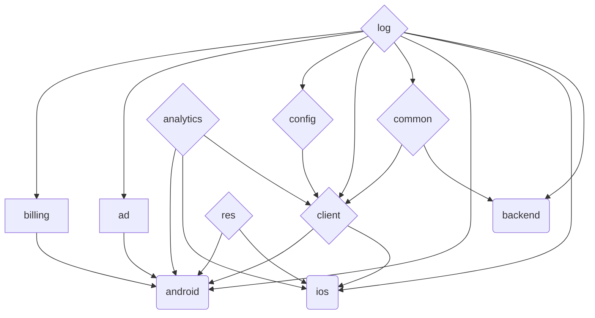

<h1 align="center">Currency Converter & Calculator</h1>

<div align="center">

A currency converter application for most of the currencies used in the world.

You can quickly convert and make mathematical operations between currencies.

<a href="https://play.google.com/store/apps/details?id=mustafaozhan.github.com.mycurrencies"></a>
<a href="https://apps.apple.com/us/app/currency-converter-calculator/id1617484510"></a>
<a href="https://appgallery.huawei.com/app/C104920917"></a>

<a href="https://github.com/Oztechan/CCC/actions/workflows/main.yml"></a>
<a href="https://www.codacy.com/gh/Oztechan/CCC/dashboard?utm_source=github.com&amp;utm_medium=referral&amp;utm_content=CurrencyConverterCalculator/CCC&amp;utm_campaign=Badge_Grade"></a>
<a href="https://codecov.io/gh/Oztechan/CCC"></a>
<a href="https://www.codacy.com/gh/Oztechan/CCC/dashboard?utm_source=github.com&amp;utm_medium=referral&amp;utm_content=CurrencyConverterCalculator/CCC&amp;utm_campaign=Badge_Coverage"></a>

<a href="https://github.com/Oztechan/CCC/commits/develop"></a>
<a href="https://github.com/Oztechan/CCC/pulls?q=is%3Apr+is%3Aopen"></a>
<a href="https://github.com/Oztechan/CCC/pulls?q=is%3Apr+is%3Aclosed"></a>
<a href="https://github.com/Oztechan/CCC/issues?q=is%3Aopen"></a>
<a href="https://github.com/Oztechan/CCC/issues?q=is%3Aclosed"></a>

<a href='https://ko-fi.com/B0B2TZMH' target='_blank'></a>

## Module Graph




</div>

## How to clone

The project uses submodules, please clone it as below:

```shell
git clone https://github.com/CurrencyConverterCalculator/CCC.git &&
cd CCC &&
git submodule update --init --recursive
```

## How to run

Be sure that you have latest Android Studio Canary build installed and XCode 13.0 or later.

### Android

Open CCC folder with Android Studio and select `android` from configurations and run

### iOS

```shell
./gradlew :client:podspec :res:podspec --parallel &&
cd ios/CCC &&
pod install --repo-update
```

Then open `CCC/ios/CCC.xcworkspace` with XCode after the packages are resolved you can run the project, please not XCode version should be bigger than `13.2.1`

### Backend

```shell
./gradlew :backend:run
```

## Testing

After you run the app probably your all API calls will fail, it is expected since the private URLs are not shared publicly. If you want the test the app with real API calls, I have prepared a fake response. Please replace all the `getRates` methods in

* `com.oztechan.ccc.common.api.backend.BackendApiImpl`
* `com.oztechan.ccc.common.api.free.FreeApiImpl`
* `com.oztechan.ccc.common.api.premium.PremiumApiImpl`

with below;

```kotlin
override suspend fun getRates(base: String): CurrencyResponse = client.get {
    url {
        takeFrom("https://gist.githubusercontent.com/mustafaozhan/fa6d05e65919085f871adc825accea46/raw/d3bf3a7771e872e0c39541fe23b4058f4ae24c41/response.json")
    }
}.body()
```

## Architecture


## Android Preview


## iOS Preview

 

## Included Currencies

[](https://github.com/CurrencyConverterCalculator/CCC/raw/develop/art/currencies.png)

## License

```text
Copyright 2017 Mustafa Ozhan

Licensed under the Apache License, Version 2.0 (the "License");
you may not use this file except in compliance with the License.
You may obtain a copy of the License at

    http://www.apache.org/licenses/LICENSE-2.0

Unless required by applicable law or agreed to in writing, software
distributed under the License is distributed on an "AS IS" BASIS,
WITHOUT WARRANTIES OR CONDITIONS OF ANY KIND, either express or implied.
See the License for the specific language governing permissions and
limitations under the License.
```